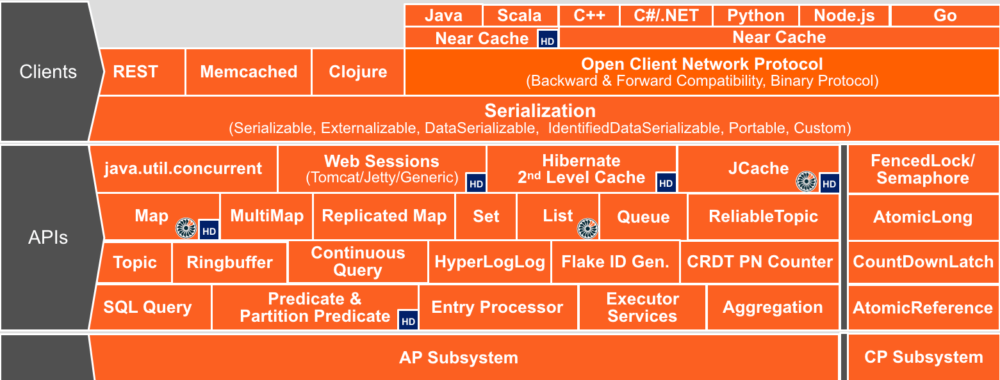
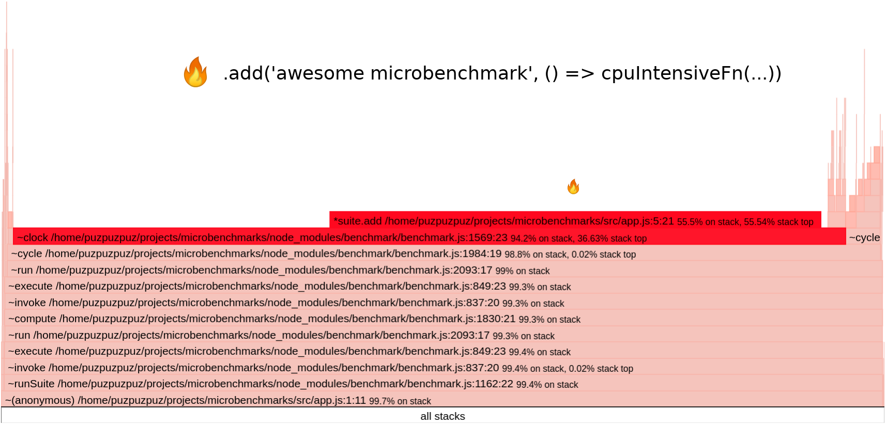
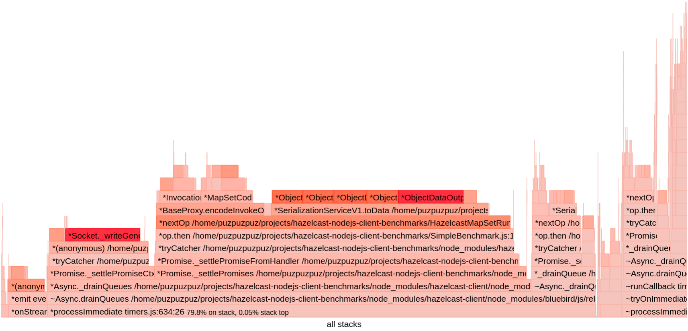
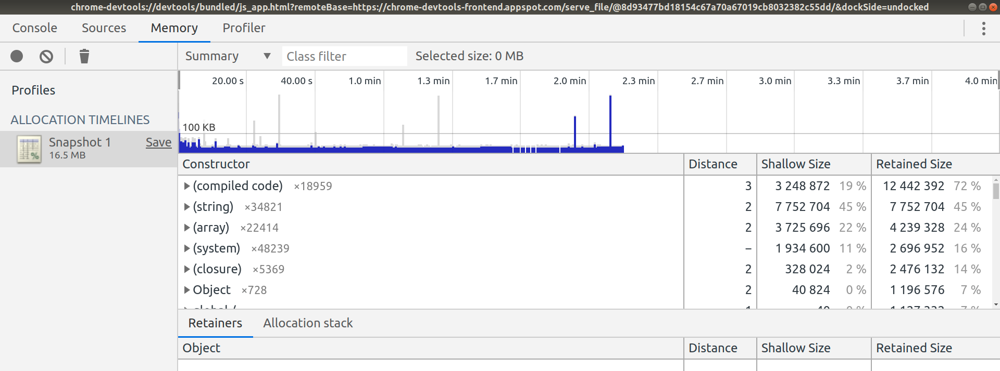
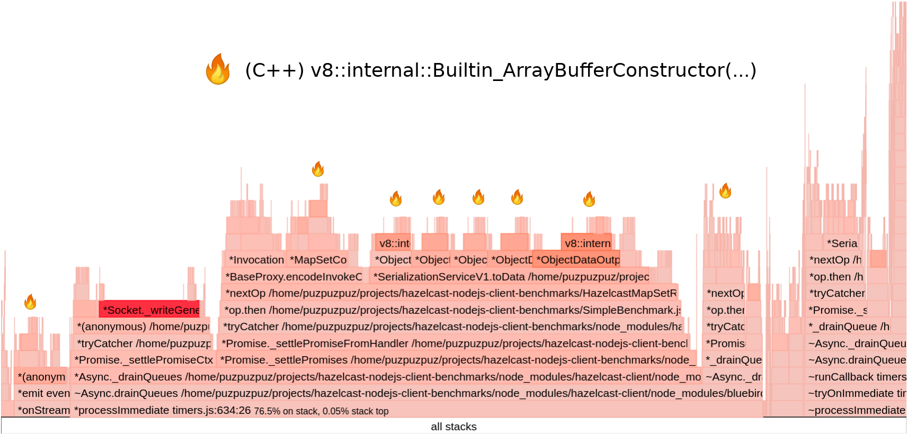
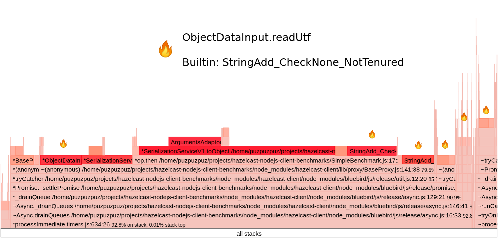
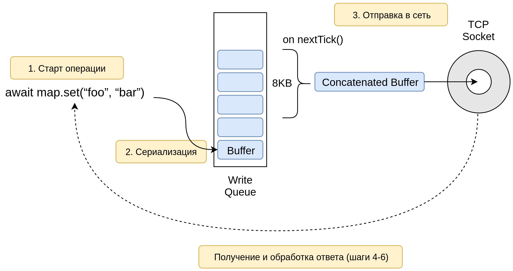

<style>
img[alt~="center"] {
  display: block;
  margin: 0 auto;
}

table td {
  width: 150px;
}
</style>

# История одной оптимизации производительности Node.js библиотеки

### Андрей Печкуров, Hazelcast

---

<!-- paginate: true -->

# О докладчике

* Пишу на Java (10+ лет), Node.js (5+ лет)
* Интересы: веб, архитектура, распределенные системы, производительность
* Можно найти тут:

  - https://twitter.com/AndreyPechkurov
  - https://github.com/puzpuzpuz
  - https://medium.com/@apechkurov

---

# О докладе

* Тема: подход к оптимизации производительности Node.js библиотек
* Подопытный: клиентская Node.js библиотека Hazelcast IMDG
* Аудитория: все, кто разрабатывает сетевые приложения на Node.js
* План:

  #1: Знакомство с подопытным
  #2: Цели и общий подход
  #3: Бенчмарки и инструменты анализа
  #4: Оптимизация: замеры, гипотезы, эксперименты
  #5: Планы на будущее

---

# #1: Знакомство с подопытным

---

# Hazelcast IMDG

* https://hazelcast.org/
* Hazelcast In-Memory Data Grid (IMDG)
* Большой набор распределенных структур данных<br/> (AP и CP согласно CAP теореме)
* Написана на Java, умеет embedded и standalone режимы
* Хорошо масштабируется вертикально и горизонтально
* Часто используется в high-load и low-latency приложениях

---

# Возможности Hazelcast IMDG



---

# Hazelcast IMDG Node.js client

* https://github.com/hazelcast/hazelcast-nodejs-client
* Node.js 4+
* Стек: TypeScript, promisified API (bluebird)
* Первый стабильный релиз - май 2019

---

# Особенности библиотеки

* "Умная" клиентская библиотека
* Общается с нодами кластера по [открытому бинарному протоколу](https://hazelcast.org/documentation/#open-binary) поверх TCP
* Поддерживает множество распределенных структур данных
* Умеет near cache, retry on failure, client stats и многое другое

---

# Пример использования

```javascript
const Client = require('hazelcast-client').Client;

const client = await Client.newHazelcastClient();
const cache = await client.getMap('my-awesome-cache');

await cache.set('foo', 'bar');
const cached = await cache.get('foo');
console.log(cached); // bar
```

---

# #2: Цели и общий подход

---

# Начальные цели

* Анализ текущей производительности перед стабильным релизом
* Включение в релиз "быстрых" правок (при необходимости)
* Постановка планов по дальнейшему анализу и оптимизации
* *Спойлер*: на сегодня большая часть из этих планов уже реализована

---

# Оптимизация?


---

# Оптимизация? Рецепт приготовления

0. Определить метрики производительности (+ желаемые значения)
1. Реализовать бенчмарк
2. Сделать замеры производительности
3. Проблема? Подобрать инструменты анализа
4. Найти узкие места, выдвинуть гипотезы и провести эксперименты
5. Сделать замеры
6. `goto 0.`

---

# Возможные метрики

* Сетевая клиентская библиотека
* I/O bound нагрузка
* Основные метрики:
  - Операции в секунду (throughput)
  - Время выполнения операции (условно, latency)
* Вспомогательные метрики:
  - Загрузка процессора
  - Потребление памяти

---

# Выбор метрик?

* Оптимизируем throughput
* Желаемые значения: ¯\\_(ツ)_/¯

---

# Выбор метрик!


---

# #3: Бенчмарки и инструменты анализа

---

# Старый бенчмарк

```javascript
// ...
run: function () {
  var key = Math.random() * ENTRY_COUNT;
  var opType = Math.floor(Math.random() * 100);
  if (opType < GET_PERCENTAGE) {
      this.map.get(key).then(this.increment.bind(this));
  }
  // ...
  setImmediate(this.run.bind(this));
}
// ...
```

---

# Старый бенчмарк: минусы

* Все операции стартуют через рекурсивный `setImmediate()`
* Нет ограничений по количеству операций (concurrency limit, backpressure)
* Операции и входные данные выбираются случайным образом
* Все это снижает результат и ухудшает детерминированность

---

# Новый бенчмарк

```javascript
const benchmark = new Benchmark({
    nextOp: () => map.get('foo'),
    totalOpsCount: REQ_COUNT,
    batchSize: BATCH_SIZE
});
await benchmark.run();
```

---

# Новый бенчмарк: плюсы

* Операции стартуют параллельно
* Общее число одновременно стартованных операций ограничено
* Операции и входные данные предопределены

---

# Новый бенчмарк: визуализация

Пример с `batchSize = 3` и `totalOpsCount = 7`:
```text
op1--->|op6--->| finish
op2->|op4------>| finish
op3->|op5-->|op7->| finish
```

Простой `Promise.all()`:
```text
op1--->|op4--->   |       finish
op2->  |op5------>|       finish
op3->  |op6-->    |op7->| finish
```

---

# Сценарий бенчмарка

* Приложение-бенчмарк с клиентской библиотекой
* Кластер из одной ноды IMDG (Docker-контейнер)
* Локальная машина (loopback address)
* Фиксированные версии Linux, Node.js, IMDG и т.д.
* Операции: `IMap.get()` и `IMap.set()`
* Данные: фиксированные строки с ASCII-символами (3 B, 1 KB, 100 KB)
* Замер: несколько запусков и вычисление среднего результата
* Каждый запуск: 1 млн операций с лимитом 100

---

# Инструмент #1

* Стандартный профилировщик Node.js
* Основан на V8 sample-based profiler
* Учитывает JS и C++ код
* `node --prof app.js`
* Можно получить человекочитаемое представление:
`node --prof-process isolate-0xnnnnnnnnnnnn-v8.log > processed.txt`

---

# Пример вывода

```
 [Summary]:
   ticks  total  nonlib   name
   4144   77.3%   78.0%  JavaScript
   1157   21.6%   21.8%  C++
    374    7.0%    7.0%  GC
     51    1.0%          Shared libraries
     11    0.2%          Unaccounted

 [JavaScript]:
   ticks  total  nonlib   name
   2104   39.2%   39.6%  Builtin: StringAdd_CheckNone_NotTenured
   1312   24.5%   24.7%  LazyCompile: *<anonymous> :1:20
    484    9.0%    9.1%  LazyCompile: *suite.add ./app.js:68:7
    ...
      8    0.1%    0.2%  LazyCompile: ~<anonymous> ./util.js:51:44
 ...
```

---

# Инструмент #2

* Визуализация профиля в виде flame graph
* Действительно помогает обнаруживать ботлнеки
* Отлично работает для event loop'а Node.js
* Спасибо Brendan Gregg, Netflix, [придумавшему подход](https://www.usenix.org/conference/lisa13/technical-sessions/plenary/gregg) в 2013
* Наиболее популярный инструмент - [0x](https://github.com/davidmarkclements/0x) (V8, perf, DTrace)
* Мы использовали [flamebearer](https://github.com/mapbox/flamebearer) (V8)

```bash
$ npm install -g flamebearer
$ node --prof-process --preprocess -j isolate*.log | flamebearer
```

---

# Пример простейшего flame graph



---

# Пример flame graph из реального мира



---

# Инструмент #3

* Профилировщик памяти из Chrome DevTools (Node.js)
* Умеет делать heap snapshot, отслеживать аллокации и не только



---

# Инструмент #4

* Микробенчмарки для быстрой проверки гипотез
* Использовался фреймворк [Benchmark.js](https://benchmarkjs.com/) (+ node-microtime)
* *Предупреждение*: могут показывать температуру в Антарктиде

---

# Инструмент #5

* Proof of concept (PoC)
* Все средства хороши, но нужен весь функционал кода на горячем пути
* *П.С.*: это не совсем инструмент, но не упомянуть нельзя

---

# Проверяем чеклист

```
[X] Метрики
[X] Бенчмарк
[X] Инструменты анализа
[ ] Оптимизация
```

---

# #4: Оптимизация: замеры, гипотезы, эксперименты

---

# Горячий путь

1. Старт операции (создание `Promise`)
2. Сериализация сообщения в бинарный формат
3. Отправка в сеть в `socket.write(...)`
5. Чтение фрейма в `socket.on('data', ...)`
6. Десериализация ответного сообщения
7. Вызов `resolve()` у `Promise`'а операции

---

# Базовый замер

&nbsp; | 3 B | 1 KB | 100 KB
------------:|------------:| ------------:| ------------:
`Map#get()` | 90 933 | 23 591 | 105
`Map#set()` | 76 011 | 44 324 | 1 558

---

# Видны проблемы?

* Java-клиент для `get('foo', 'bar')` быстрее примерно в 5 раз
(сравнение заведомо некорректное)
* Производительность практически линейно зависит от размера данных

---

# Профилировщик, приди! (запись 3 B)



---

# Хьюстон, у нас аллокации

* Для работы с бинарными данными, конечно, используется [Buffer](https://nodejs.org/api/buffer.html)
* В на горячем пути много `Buffer#alloc()/#allocUnsafe()`, а это "дорогая" операция
* Во время сериализации одной операции происходит несколько аллокаций, а затем буферы копируются в финальный
* Это упрощает код, но производительность страдает
* Сначала делаем PoC с полумерой, поскольку полная правка требует много времени

---

# PoC с полумерой

```javascript
export class ObjectDataOutput implements DataOutput {

    protected buffer: Buffer;
    private pos: number;

    constructor() {
        // пробуем аллоцировать жадно
-       this.buffer = Buffer.allocUnsafe(1);
+       this.buffer = Buffer.allocUnsafe(1024);

        // ...
```

---

# Замер производительности PoC

&nbsp; | `get()`<br/>3 B | `get()`<br/>1 KB | `get()`<br/>100 KB | `set()`<br/>3 B | `set()`<br/>1 KB | `set()`<br/>100 KB
------------:| ------------:| ------------:| ------------:| ------------:| ------------:| ------------:
v0.10.0 | 90 933 | 23 591 | 105 | 76 011 | 44 324 | 1 558
PoC | 104 854 | 24 929 | 109 | 95 165 | 52 809 | 1 581
&nbsp; | **+15%** | **+5%** | **+3%** | **+25%** | **+19%** | **+1%**

---

# Промежуточные итоги

* Гипотеза верна и правка идет в ближайший релиз
* Нужно избавиться от оставшихся лишних аллокаций в будущих релизах
* Результаты для больших размеров оставляют желать лучшего
* Так что же у нас с зависимостью от размера данных?

---

# Профилировщик, приди! (чтения 100 KB)

<!-- TODO объяснить большое плато с BaseProxy.js -->



---

# А что это у нас там?

```javascript
private readUTF(pos?: number): string {
    const len = this.readInt(pos);
    // ...
    for (let i = 0; i < len; i++) {
        let charCode: number;
        leadingByte = this.readByte(readingIndex) & MASK_1BYTE;
        readingIndex = this.addOrUndefined(readingIndex, 1);
        const b = leadingByte & 0xFF;
        switch (b >> 4) {
            // ...
        }
        result += String.fromCharCode(charCode);
    }
    return result;
}
```

---

# Предварительная оптимизация?

* Итак, у нас нестандартная (де)сериализация UTF-8 строк
* Похоже на предварительную оптимизацию
* Почему бы не сравнить со стандартным API?

```javascript
// сериализация
buf.write(inStr, start, end, 'utf8');
// десериализация
const outStr = buf.toString('utf8', start, end);
```

---

# Микробенчмарк

&nbsp; | 100 B ASCII | 100 KB ASCII | 100 B UTF | 100 KB UTF
------------:| ------------:| ------------:| ------------:| ------------:
custom | 1 515 803 | 616 | 1 093 390 | 613
standard | 11 297 821 | 68 721 | 1 311 610 | 794
&nbsp; | **+645%** | **+11 056%** | **+20%** | **+29%**

\* Результаты для десериализации в ops/sec

---

# Проваливаемся в кроличью нору

* [Buffer#toString()](https://github.com/nodejs/node/blob/v10.15.3/lib/buffer.js#L667)
* [node:buffer.js#stringSlice()](https://github.com/nodejs/node/blob/v10.15.3/lib/buffer.js#L594)
* [node:node_buffer.cc#StringSlice()](https://github.com/nodejs/node/blob/v10.15.3/src/node_buffer.cc#L452)
* [node:StringBytes#Encode()](https://github.com/nodejs/node/blob/v10.15.3/src/string_bytes.cc#L665)
* [v8:String#NewFromUtf8()](https://github.com/v8/v8/blob/lkgr/6.8/src/api.cc#L6622)
* [v8:Factory#NewStringFromUtf8()](https://github.com/v8/v8/blob/lkgr/6.8/src/heap/factory.cc#L609)
* [v8:Factory#NewStringFromOneByte()](https://github.com/v8/v8/blob/lkgr/6.8/src/heap/factory.cc#L583)

---

# Что там, в норе?

```c++
// v8:Factory#NewStringFromUtf8()
MaybeHandle<String> Factory::NewStringFromUtf8(
    Vector<const char> string,
    PretenureFlag pretenure
) {
  // Check for ASCII first since this is the common case.
  const char* ascii_data = string.start();
  int length = string.length();
  int non_ascii_start = String::NonAsciiStart(ascii_data, length);
  if (non_ascii_start >= length) {
    // If the string is ASCII, we do not need to convert
    // the characters since UTF8 is backwards compatible with ASCII.
    return
      NewStringFromOneByte(
        Vector<const uint8_t>::cast(string), pretenure);
  }
// ...
```

---

# PoC для сериализации

&nbsp; | `get()`<br/>3 B | `get()`<br/>1 KB | `get()`<br/>100 KB | `set()`<br/>3 B | `set()`<br/>1 KB | `set()`<br/>100 KB
------------:| ------------:| ------------:| ------------:| ------------:| ------------:| ------------:
v0.10.0 | 90 933 | 23 591 | 105 | 76 011 | 44 324 | 1 558
PoC | 122 458 | 104 090 | 7 052 | 110 083 | 73 618 | 8 428
&nbsp; | **+34%** | **+341%** | **+6 616%** | **+45%** | **+66%** | **+440%**

---

# Промежуточные итоги

* Гипотеза верна и правка идет в ближайший релиз

---

# Первый публичный релиз 🎉

&nbsp; | `get()`<br/>3 B | `get()`<br/>1 KB | `get()`<br/>100 KB | `set()`<br/>3 B | `set()`<br/>1 KB | `set()`<br/>100 KB
------------:| ------------:| ------------:| ------------:| ------------:| ------------:| ------------:
v0.10.0 | 90 933 | 23 591 | 105 | 76 011 | 44 324 | 1 558
v3.12 | 132 855 | 120 670 | 8 756 | 127 291 | 94 625 | 10 617
&nbsp; | **+46%** | **+411%** | **+8 239%** | **+67%** | **+113%** | **+581%**

---

# Editor's Cut

* Эксперимент с пулом буферов для сериализации
  - Неудачный. К тому же, `Buffer#allocUnsafe()` и так [использует](https://nodejs.org/api/buffer.html#buffer_class_method_buffer_allocunsafeslow_size) пул (8 KB by default)
* Эксперимент с Write Queue (aka Automated Pipelining)
  - Оказался перспективным и был отложен до следующего релиза. Простой PoC показал увеличение write throughput на 20-25%

---

# Оптимизация Automated Pipelining

* Подобная оптимизация использована в [классе WriteQueue](https://github.com/datastax/nodejs-driver/blob/master/lib/writers.js#L176) в Datastax's NodeJS driver for Apache Cassandra
* Идея в объединении сообщений перед записью в сокет
* В результате, делается меньше "дорогих" вызовов `Socket#write()`
* В блокирующихся клиентах схожий прием называют [pipelining](http://informatikr.com/2012/redis-pipelining.html)
* В нашем случае, объединение происходит неявным образом, отсюда automated pipelining

---

# Логика работы Automated Pipelining



---

# Особенности реализации

* Для больших сообщений эта оптимизация может ухудшить производительность
* Поэтому добавлена настройка библиотеки, включающая "обычный" режим
* Порог записи в сеть тоже вынесен в настройки

---

# Снова релиз?

* Automated Pipelining пошла в ближайший релиз
* Кроме этого, туда вошли минорные оптимизации для горячего пути:
  - Убрали мусор от `new Date().getTime()` (спасибо, `Date.now()`)
  - Убрали мусор от лишних конвертаций `number` <-> `Long` (используется [long.js](https://github.com/dcodeIO/long.js))
  - Оптимизировали аллокации буферов в edge cases, например, при чтении бооольших сообщений (> 128 KB)
* *Спойлер*: заметной прибавки минорные оптимизации не дали, но они все равно полезны

---

# Второй публичный релиз

&nbsp; | `get()`<br/>3 B | `get()`<br/>1 KB | `get()`<br/>100 KB | `set()`<br/>3 B | `set()`<br/>1 KB | `set()`<br/>100 KB
------------:| ------------:| ------------:| ------------:| ------------:| ------------:| ------------:
v3.12 | 132 855 | 120 670 | 8 756 | 127 291 | 94 625 | 10 617
v3.12.1 | 173 611 | 161 812 | 10 879 | 172 028 | 82 747 | 8 208
&nbsp; | **+30%** | **+34%** | **+24%** | **+35%** | **-13%** | **-23%**

\* Замеры с включенной Automated Pipelining

---

# А как же аллокации?

* Поскольку правки объемные, было решено начать с PoC
* PoC реализует оптимизацию только для `IMap.get()` and `IMap.set()`
* Он позволит оценить, оправдает ли оптимизация вложенные усилия

---

# PoC без лишних аллокаций

&nbsp; | `get()`<br/>3 B | `get()`<br/>1 KB | `get()`<br/>100 KB | `set()`<br/>3 B | `set()`<br/>1 KB | `set()`<br/>100 KB
------------:| ------------:| ------------:| ------------:| ------------:| ------------:| ------------:
v3.12.1 | 173 611 | 161 812 | 10 879 | 172 028 | 82 747 | 8 208
PoC | 222 172 | 192 122 | 12 594 | 205 254 | 109 051 | 11 630
&nbsp; | **+28%** | **+19%** | **+16%** | **+19%** | **+32%** | **+42%**

\* Замеры с включенной Automated Pipelining

---

# Сравним с тем, что было в начале

&nbsp; | `get()`<br/>3 B | `get()`<br/>1 KB | `get()`<br/>100 KB | `set()`<br/>3 B | `set()`<br/>1 KB | `set()`<br/>100 KB
------------:| ------------:| ------------:| ------------:| ------------:| ------------:| ------------:
v0.10.0 | 90 933 | 23 591 | 105 | 76 011 | 44 324 | 1 558
PoC | 222 172 | 192 122 | 12 594 | 205 254 | 109 051 | 11 630
&nbsp; | **+144%** | **+714%** | **+11&nbsp;894%** | **+170%** | **+146%** | **+646%**

\* Замеры с включенной Automated Pipelining

---

# Наконец-то!


---

# #5: Планы на будущее

1. Избавиться от лишних аллокаций буферов
2. Включить замеры производительности в релиз цикл
3. Продолжить оптимизацию

---

# Немного советов

<!-- TODO подумать про доп. советы -->

* Не пытайтесь оптимизировать все и сразу
* Старайтесь уменьшить число неизвестных и движущихся частей
* Проверяйте гипотезы при помощи PoC и, если нужно, микробенчмарков
* Не забывайте, что оптимизация производительности - это процесс

---

# Полезные ссылки

* https://hazelcast.org/
* https://github.com/hazelcast/hazelcast-nodejs-client
* https://nodejs.org/en/docs/guides/simple-profiling/
* https://nodejs.org/en/docs/guides/dont-block-the-event-loop/
* https://blog.insiderattack.net/event-loop-and-the-big-picture-nodejs-event-loop-part-1-1cb67a182810

---

# Слайды


---

# Спасибо за внимание!

## Время для Q&A
