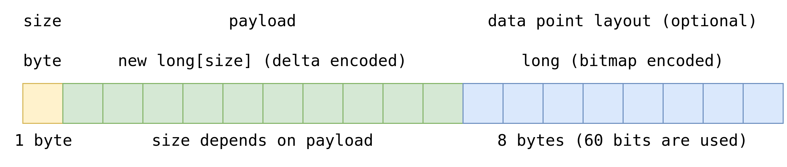

<style>
section.lead h1 {
  padding-top: 12px;
}

section.lead h1, section.lead h2 {
  padding-left: 30px;
}

section {
  font-size: 30px;
}

h1 {
  font-size: 42px;
  color: #5c5c5c;
}

pre {
  line-height: 1.4;
}

img[alt~="center"] {
  display: block;
  margin: 0 auto;
}

table td {
  width: 150px;
}
</style>

<!-- _class: lead -->

# Embedded Time Series Storage:<br/>A Cookbook

## Andrey Pechkurov


---

<!-- paginate: true -->

# About me

* Java (for a long time) and Node.js (for quite a long time) developer
* Node.js core collaborator
* Interests: web, system architecture, distributed systems, performance
* Can be found here:

  - https://twitter.com/AndreyPechkurov
  - https://github.com/puzpuzpuz
  - https://medium.com/@apechkurov

---


* Hazelcast IMDG Management Center (MC)
* Monitoring & management application for IMDG clusters
* Supports stand-alone and servlet container deployment
* Self-contained application, i.e. .jar file and Java is everything you need to run MC
* Frontend part is built with TypeScript, React and Redux
* Backend part is built with Java, Spring and IMDG Java client

---

<!-- # The topic

* For an upcoming version of MC we had to implement an embedded time series storage from existing components
* So, we are going to talk of considered options, experienced problems and technical decisions -->

# Agenda

* A quick intro
* The problem
* Considered options
* Decisions made
* Results and plans

---

<style scoped>
section h1 {
  position: absolute;
  top: 261px;
  left: 90px;
}
</style>


# A quick intro

---

# Terminology

**Metric** - a numerical value that can be measured at particular time and has a real world meaning. Examples: CPU load, used heap memory. Characterized by name and a set of tags.

**Data point** - a metric value measured at the given time. Characterized by metric, timestamp (Unix time) and a value.

---

# Types of metrics

* Gauge (e.g. CPU load, memory consumption)
* Counter (e.g. number of processed operations)
* Histogram (e.g. operation processing latency) - not supported yet

<!-- TODO add illustrations -->

---

# What we mean by "time series"

"Time series" (TS) stand for series of metric data points

```java
class DataPoint {

    String metric;
    List<Map.Entry<String, String>> tags;
    long time;
    long value;

}
```

---

# Sample data point


---

# Simple math


---

# Simple math


---

# Summary

Time series data (usually) implies:
* Lots of writes. Thus, large data volume
* Significantly less reads
* Raw and aggregate queries

---

# Storage formats

* Columnar storage format
* Log-structured merge-tree (LSM tree)
* B-tree
* Their variations

<!-- TODO double check the list -->

---

# Columnar format

<!-- TODO add illustration -->

---

# LSM tree

<!-- TODO add illustration -->

---

# Data compression

* Integer compression
  - Delta encoding
  - Delta-of-delta encoding
  - Simple-8b
  - Run-length encoding
* Floating point compression
  - XOR-based compression
* Type-agnostic compression
  - Dictionary compression

---

<style scoped>
section h1 {
  position: absolute;
  top: 261px;
  left: 90px;
}
</style>


# The problem

---

# The problem

* In the past IMDG clusters were reporting their metrics as a large JSON object
* MC was storing collected JSONs into a key-value storage (in-memory and/or JDBM)
* Such approach has some downsides that are critical for us
* Say, it requires changes in many places when we had to add new metrics

---

# The solution

IMDG v4.0+ is capable of reporting collected metrics (probes) to MC in a generic manner


---

# The challenge

* MC has to store those metrics somehow
* Thus, we need a Time Series Storage
* Here comes the challenge...

---

# Requirements - must haves

* Embedded time series database or storage
* In-memory and optional persistent modes
* Data compression to achieve low disk footprint in the persistent mode
* Support data retention to avoid running of disk space
* Durability and fault tolerance in the persistent mode

---

# Requirements - nice to haves

* Good write performance (100Ks data points/second on average HW)
* Good enough read performance (10Ks data points/second on average HW)
* Use existing stable SW, when possible

---

<style scoped>
section h1 {
  position: absolute;
  top: 261px;
  left: 90px;
}
</style>


# Considered options

---

# TS DBs

* OpenTSDB
* InfluxDB
* TimescaleDB
* Prometheus
* ClickHouse
* Kdb+
* Graphite
* etc.

<!-- put logos here -->

---

# Embedded TS DBs/storages

* Akumuli (C++) - https://akumuli.org
* QuestDB (Java) - https://www.questdb.io

---

# Embedded non-TS DBs/storages

* SQL DBs
  - H2 DB (B-tree)
* Key-value storages
  - H2's MVStore (B-tree)
  - MapDB (HTree, B-tree)
  - RocksDB (LSM tree)

<!-- TODO: consider using a table here -->

---

<style scoped>
section h1 {
  position: absolute;
  top: 261px;
  left: 90px;
}
</style>


# Decisions made

---

# Initial ideas

After initial research and experiments we decided the following:
* Build a TS storage on top of a key-value storage
* Keep the storage API simple

---

# Primitive data layout


---

# Draft API

```java
public interface MetricsStorage extends AutoCloseable {

    void store(Collection<DataPoint> dataPoints);

    DataPointSeries queryRange(Query query);

    Optional<DataPoint> queryLatest(Query query);

}
```

---

# TODO list

1. Choose one of embedded key-value storages
2. Come up with a way to reduce number of persisted entries
3. Think of sufficient data compression for the persisted data

---

# Item 1: embedded key-value storage

After some experiments we picked up two candidates
* MapDB (Java)
* RocksDB (C++ with JNI bindings)

<!-- TODO add more fields and use a table -->

---

# Item 2: number of persisted entries

* We need to group multiple data points into a single entry somehow
* What if we store data points in buckets? Say, a bucket per minute

---

# Bucketed data layout


---

# Item 3: data compression

* Keys
  - We could use dictionary compression for metrics
* Values
  - For each minute bucket we could use compression methods for integer numbers, like delta encoding

---

# Overall design


---

# Writes


---

# Reads


---

# Metrics Registry


---

# Data compression: keys


---

# Data compression: values



---

# Values compression efficiency

| Scenario | Raw* (bytes) | Delta&nbsp;compressed* (bytes) | Compressed (bytes) | Ratio (vs.&nbsp;Raw) |
|---|--:|--:|--:|-:|
| Const&nbsp;`int` (3&nbsp;sec) | 480 | 360 | 13 | x37 |
| Random&nbsp;`int` (3&nbsp;sec) | 480 | 364 | 156 | x3 |

\* `Long.MIN_VALUE` is used to represent missing values

---

# Other features

* Data retention
  - Based on per entry time-to-live (TTL) in RocksDB
* Data durability
  - Pending minute buckets are persisted on graceful shutdown
* Aggregation API
  - Built on top of the storage

<!-- TODO: describe potential problems,
       like insufficient in-memory cache size and
            out of order writes
-->

---

<style scoped>
section h1 {
  position: absolute;
  top: 261px;
  left: 90px;
}
</style>


# Results and plans

---

# Benchmark results

* Scenario:
  - Emulates 10 members, 120,000 metrics, 3 second interval
  - Random values from 0-1000 range
* Writes* - 400K data point/sec
* Random minute series reads* - 19K ops/sec

\* Results were obtained on a laptop

---

# Further plans

* Support additional indexes for metrics
* Expose diagnostics information in runtime
* Perform additional testing and optimization

---


# Call to action

* You may want to give a try with IMDG and MC: https://hazelcast.org/
* Open source contributions are welcome as well!

---

# Thank you!

<!-- TODO fix the code -->


---

# Helpful links

* https://docs.hazelcast.org/docs/4.0.1/manual/html-single/index.html#metrics
* https://blog.timescale.com/blog/time-series-compression-algorithms-explained/

<!-- TODO add more links -->
