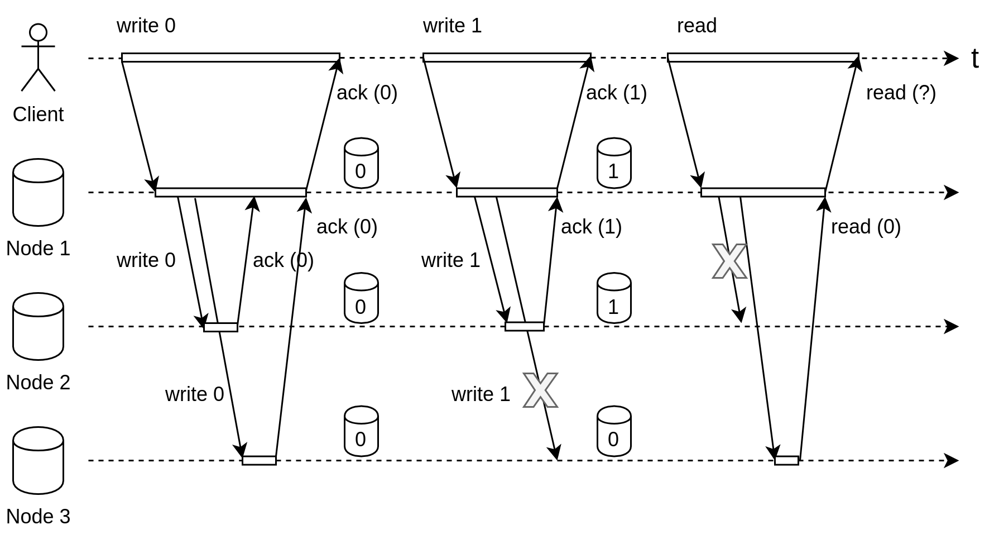
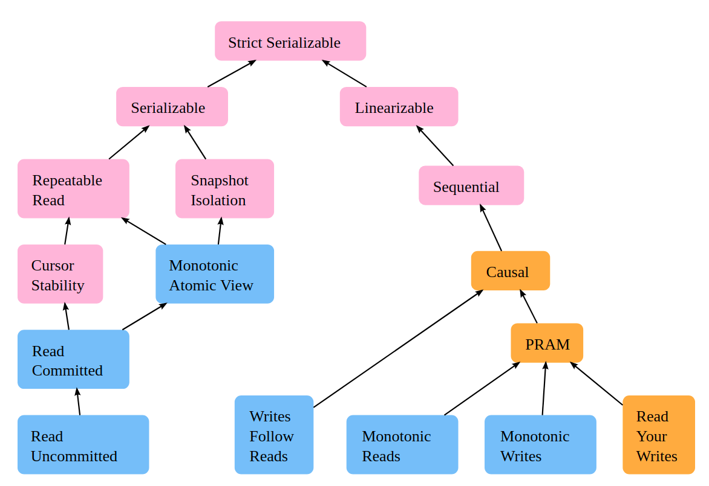
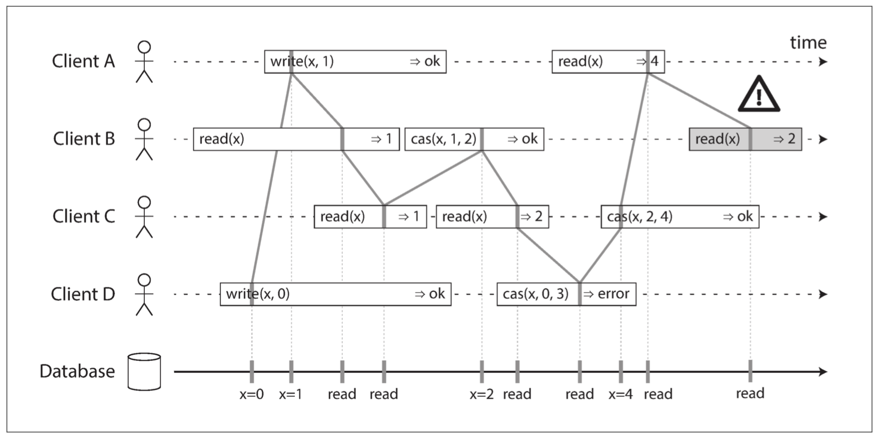
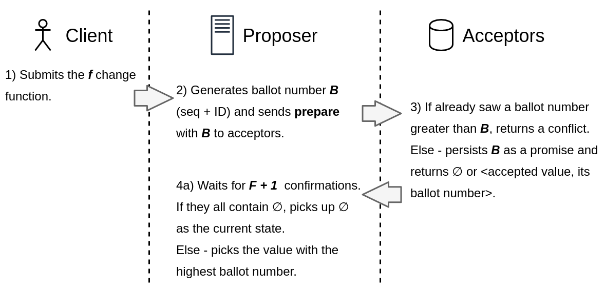
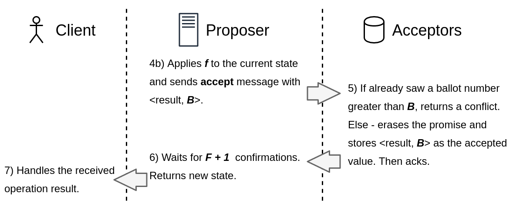

<style>
section.lead h1 {
  padding-top: 12px;
}

section.lead h1, section.lead h2 {
  padding-left: 30px;
}

section {
  font-size: 30px;
}

h1 {
  font-size: 42px;
  color: #5c5c5c;
}

pre {
  line-height: 1.4;
}

img[alt~="center"] {
  display: block;
  margin: 0 auto;
}

table td {
  width: 150px;
}
</style>

<!-- _class: lead -->

# Немного об алгоритмах консенсуса.<br/>Казалось бы, при чем тут Node.js?

## Андрей Печкуров


---

<!-- paginate: true -->

# О докладчике

* Пишу на Java (очень долго), Node.js (долго)
* Node.js core collaborator
* Интересы: веб, архитектура, распределенные системы, производительность
* Можно найти тут:

  - https://twitter.com/AndreyPechkurov
  - https://github.com/puzpuzpuz
  - https://medium.com/@apechkurov

---


* Hazelcast In-Memory Data Grid (IMDG)
* Большой набор распределенных структур данных
* Показательный пример - `Map`, который часто используют как кэш
* Написана на Java, умеет embedded и standalone режимы
* Хорошо масштабируется вертикально и горизонтально
* Часто используется в high-load и low-latency приложениях
* Области применения: IoT, in-memory stream processing, payment processing, fraud detection и т.д.

---


* Hazelcast In-Memory Data Grid (IMDG)
* Хотите production-ready Raft? У нас есть CP Subsystem (с Jepsen тестами и локами 🙂)
* https://docs.hazelcast.org/docs/4.0.1/manual/html-single/index.html#cp-subsystem

---

<br/><br/>

# Hazelcast IMDG Node.js client

<style scoped>
section {
  background: #fff url(images/hazelcast-plus-node.jpg) no-repeat center 80px;
  background-size: 400px;
}
</style>

* https://github.com/hazelcast/hazelcast-nodejs-client
* Доклад про историю оптимизаций
  - Видео: https://youtu.be/CSnmpbZsVD4
  - Слайды: https://github.com/puzpuzpuz/talks/tree/master/2019-ru-nodejs-library-optimization
* P.S. Поддержки CP Subsystem в этом клиенте пока нет, но она скоро будет

---

# План на сегодня

* Начинаем пугаться распределенных систем
* Знакомимся с видами согласованности (consistency)
* CAP теорема и прочие классификации
* Что за зверь - алгоритм консенсуса?
* История: Paxos и его подвиды, Raft
* CASPaxos, как один из недавних Paxos-образных
* Pet project: CASPaxos на Node.js

---

<style scoped>
section h1 {
  position: absolute;
  top: 261px;
  left: 90px;
}
</style>


# Начинаем пугаться<br/>распределенных систем

---

# Упрощенная до ужаса история

* Традиционно были РСУБД на бооольших, дорогих железках
* Однако, в 80-90х уже были академический интерес к распределенным системам
* В начале 2000х некоторые компании (намек на Google) сделали ставку на доступное железо и распределенные системы
* Основной бум пришелся на 2010е годы

---

# Распределенная система

* Назовем распределенной систему, хранящую состояние (общее) на нескольких машинах, соединенных сетью
* Для определенности будем подразумевать хранилище пар ключ-значение

---

# Принципиальные отличия

|Централизованная&nbsp;система|Распределенная&nbsp;система|
|---|---|
|Вертикальное масштабирование|Горизонтальное масштабирование|
|Локальные вызовы|Сетевые вызовы|
|< p отказа машины|> p отказа машины|
|> критичность отказа|< критичность отказа|

---

# Fallacies of distributed computing

* Инженеры из Sun (R.I.P.) сформулировали список заблуждений (1994):
  - The network is reliable
  - Latency is zero
  - Bandwidth is infinite
  - The network is secure
  - Topology doesn't change
  - There is one administrator
  - Transport cost is zero
  - The network is homogeneous
* P.S. Добавим сюда "Clocks are in sync"

---

# Сеть

* Мы работаем с асинхронными сетями
* Отправленный запрос может:
  - Быть потерян при отправке туда/обратно
  - Находиться в очереди ожидания отправки (если сеть под нагрузкой)
  - Быть получен, но машина-адресат дала сбой до или во время обработки
* Единственный способ подтверждение - получить ответ

---

# Часы

* Глобальные (синхронизированные) часы невозможны без специального железа
* Монотонные часы, впрочем, доступны, но не помогут, например, при разрешении коллизий
* Байка: в Google Spanner часы в ЦОД синхронизированы в пределах 7 мс (атомные часы + GPS)

---

# Чего мы ждем от распределенной системы?

1. Отказоустойчивость
2. Масштабируемость
3. Удобство поддержки (мониторинг, администрирование)

---

# Чего мы еще ждем?

* Допустим, что от распределенного хранилища данных мы ждем того же поведения, что и от централизованного
* А именно - с клиентской стороны поведение должно быть, как если бы это была централизованная система (пока остановимся на этой формулировке)

---

# Фигня вопрос - сейчас придумаем алгоритм

1. Любой узел принимает клиентские запросы (прочитать/записать)
2. Затем - отправляет операцию на все остальные узлы
3. Ждет ответов от большинства (консенсус жеж 😁)
4. Дождавшись консенсуса, отправляет клиенту сообщение об успехе

---

# Что не так с нашим изобретением?



---

<style scoped>
section h1 {
  position: absolute;
  top: 261px;
  left: 90px;
}
</style>


# Знакомимся с видами<br/>согласованности (consistency)

---

# Неформальное определение

Модель согласованности (consistency model) - это гарантии, которые система (внезапно, не только распределенная) предоставляет относительно набора поддерживаемых операций

---

# Eventual consistency

Система гарантирует, что данные будут доступны на всех узлах через какое-то (неопределенное) время после завершения операций записи

---

# Monotonic reads

Система гарантирует, что если какой-то (конкретный) клиент читает запись, последовательные чтения той же записи вернут то же самое, или более познее значение

---



Source: https://jepsen.io/consistency

---

# Linearizability

* Одна из наиболее строгих (сильных) моделей согласованности для __одного__ объекта
* Именно ее мы подразумевали (надеюсь ранее):
  "с клиентской стороны поведение должно быть, как если бы это была централизованная система"

---

# Неформальное определение linearizability

* Система гарантирует, что каждая операция выполняется атомарно, в __некотором__ (общем для всех клиентов) порядке, не противоречащим порядку выполнения операций в реальном времени
* Т.е. если операция A завершается до начала операции B, то B должна учитывать результат выполнения операции A

---



Source: DDIA book

---

<style scoped>
section h1 {
  position: absolute;
  top: 261px;
  left: 90px;
}
</style>


# CAP теорема и прочие классификации

---

# CAP теорема

* Сформулирована Eric Brewer в 1998, как утверждение
* В 2002 появилось формальное доказательство
* Рассматривается система с одним регистром
* CAP:
  - Consistency: здесь подразумевается линеаризуемость
  - Availability: каждый запрос, полученный нормально функционирующим узлом системы, должен приводить к ожидаемому ответу (не к ошибке)
  - Partition tolerance: подразумевает коммуникацию через асинхронную сеть

---

# Partition tolerance

Network partition - сценарий, когда узлы продолжают функционировать, но некоторые из них не могут общаться между собой

---

# Неформальное определение

В условиях network partition рассматриваемая система может быть:
* Доступна (AP)
* Согласована (CP)

P.S. CA опции в CAP теореме нет и в помине

---

# Критика

* Однобокая классификация, которая почему-то прижилась
* Например, РСУБД с одной read-only репликой не является ни CP, ни AP
* Теорема ничего не говорит о latency системы, т.е. AP система может отвечать сколь угодно медленно
* Наконец, network partition - далеко не единственный сценарий отказа

---

# Альтернативы

* PACELC теорема - расширение CAP теоремы (Daniel J. Abadi, 2010)
* PAC = PA | PC (та же CAP теорема)
* ELC = EL | EC:
  - E: else
  - L: latency
  - C: consistency

---

<style scoped>
section h1 {
  position: absolute;
  top: 261px;
  left: 90px;
}
</style>


# Что за зверь - алгоритм консенсуса?

---

# Неформальное определение

* Алгоритм консенсуса - алгоритм, позволяющий узлам системы достигнуть консенсус, т.е. принять совместное решение __о том или ином__ действии
* Под действием понимают __однократное__ изменение регистра (например, в Paxos)
* С точки зрения отказов рассматривают только non-Byzantine faults
* P.S. А еще есть FLP result (1985), доказывающий невозможность консенсуса в асинхронных системах (🤯)

---

# Связь с linearizability

* На практике консенсус нужен на __последовательности__ действий
* Поэтому для реализаций встречается определение atomic broadcast (total order broadcast) - консенсус тут нужен для принятия решения о следующем действии
* Можно показать, что linearizability и total order broadcast можно свести друг к другу
* А значит, мы говорим о CP системах, с точки зрения пресловутой CAP теоремы

---

# Краткий список алгоритмов консенсуса

* Viewstamped Replication - 1988
* Paxos и его подвиды (Chubby, Spanner) - 1989
* Raft (Consul, etcd, Hazelcast IMDG, RethinkDB, TiKV, etc.) - 2013
* ZAB (ZooKeeper)
* И другие специфичные для конкретного продукта алгоритмы

---

# Верификация корректности (неполный список вариантов)

* TLA+ (L.Lamport) - теория
* Jepsen (K.Kingsbury) - практика

---

# Применение алгоритмов консенсуса

* Linearizable key-value storage
* Distributed locks*
* Leader election
* Constraints (e.g. uniqueness)
* Atomic commit (distributed transactions)

---

# Темная сторона алгоритмов консенсуса

* Производительность напрямую зависит от задержек сети
* Высокая сложность реализации и верификации
* Для работы кластера требуется строгое большинство узлов (что логично)

---

<style scoped>
section h1 {
  position: absolute;
  top: 261px;
  left: 90px;
}
</style>


# История: Paxos и его подвиды, Raft

---

# Vanilla Paxos

* Paxos (1998) - p2p (leaderless)
* В основе - Synod/Single-Decree Paxos
* Позволяет принять строго одно решение (о значении регистра)
* Часто под Paxos подразумевают семейство алгоритмов

---

# Подвиды Paxos

* Multipaxos (2001)
* FastPaxos (2004~2005)
* Generalized Paxos (2004~2005)
* Mencius (2008)
* Multicoordinated Paxos (2006)
* Vertical Paxos (2009)
* Ring Paxos (2010) / Multi-Ring Paxos (2010)
* SPaxos (2012) / EPaxos (2013) / FPaxos (2016) / KPaxos (2017) / WPaxos (2017)
* __CASPaxos__ (2018)
* SDPaxos (2018)

---

# Raft

* Raft (2013) - single leader, replicated log
* Время делится на периоды (term), каждый из которых начинается в выбора лидера
* Упор сделан на простоту понимания алгоритма
* https://raft.github.io

---

<style scoped>
section h1 {
  position: absolute;
  top: 261px;
  left: 90px;
}
</style>


# CASPaxos, как один<br/>из недавних Paxos-образных

---

# CASPaxos

* CASPaxos (D.Rystsov, 2018) - p2p, replicated state
* CAS - compare-and-set/compare-and-swap
* Модифицирует Paxos (Synod), а не просто использует его как компонент для построения системы

---

# Основы CASPaxos

* Использует один регистр (объект)
* Вводит несколько ролей для процессов:
  - Clients: клиенты системы, отправляют запросы к Proposer
  - Proposers: принимают запросы клиентов, генерируют уникальные номера (proposal ID) и общаются с Acceptors
  - Acceptors: могут принимать предложения Proposers, хранят принятое состояние
* Для сохранения работоспособности системы до `F` отказов, нужны `2F + 1` Acceptors

---

# Phase 1



---

# Phase 2



---

# Связь с Synod

CASPaxos эквивалентен Synod, если взять функцию:
```
x -> if x = ∅ then val0 else x
```

---

# CAS регистр на основе CASPaxos

Чтение:
```
x -> x
```

Инициализация значением `val0`:
```
x -> if x = ∅ then (0, val0) else x
```

Запись значения `val1` при условии версии `3`:
```
x -> if x = (3, *) then (4, val1) else x
```

---

# CASPaxos-based key-value storage

* Хранилище - это набор именованных экземпляров CASPaxos, по одному на ключ
* Преимущества и недостатки подхода в сравнении с тем же Raft выходят за рамки доклада

---

# Pet project: CASPaxos на Node.js

https://github.com/gryadka/js (Node.js - proposers, Redis - acceptors)
||
\\/
https://github.com/puzpuzpuz/ogorod (Node.js - proposers & acceptors)

---

# Ogorod TODOs

* Add applicable *Paxos optimizations, like CASPaxos 1RTT optimization
* Dynamic configuration support, including proposer configuration versioning and persistence
* Implement delete operation support. Requires a GC-like background process (see the CASPaxos paper for more details)
* Use an embedded key-value storage, like RocksDB, for data persistence
* Swap HTTP with plain TCP communication for the internal API
* Implement proper error handling and logging
* And many-many more

---

<br/><br/>

# Call to Action

<style scoped>
section {
  background: #fff url(images/hazelcast-plus-node.jpg) no-repeat center 80px;
  background-size: 400px;
}
</style>

* Распределенных систем бояться - на server-side не ходить
* Все, кому интересны высокопроизводительные библиотеки<br/>(и распределенные системы) - welcome
* https://github.com/hazelcast/hazelcast-nodejs-client
* P.S. Contributions are welcome as well

---

# Спасибо за внимание!


---

# Полезные книги и ссылки

* Designing Data-Intensive Applications, Martin Kleppmann, 2017
* CASPaxos: Replicated State Machines without logs, Denis Rystsov, 2018 - https://arxiv.org/abs/1802.07000
* Paxos Made Simple, Leslie Lamport, 2001 - https://lamport.azurewebsites.net/pubs/paxos-simple.pdf
* https://raft.github.io/
* https://jepsen.io
* https://martin.kleppmann.com/2015/05/11/please-stop-calling-databases-cp-or-ap.html
* https://vadosware.io/post/paxosmon-gotta-concensus-them-all/
