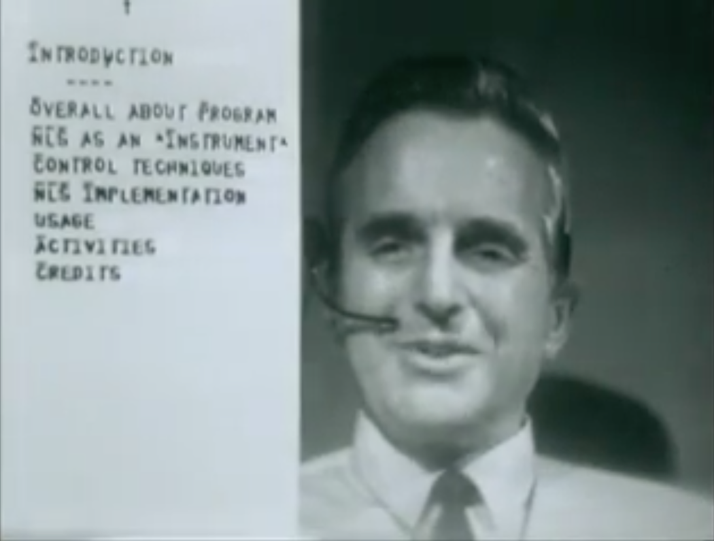

<!-- _class: lead -->

# Немного об алгоритмах консенсуса. Казалось бы, при чем тут Node.js?

## Андрей Печкуров

---

<!-- paginate: true -->

# О докладчике

* Пишу на Java (очень долго), Node.js (долго)
* Node.js core collaborator
* Интересы: веб, архитектура, распределенные системы, производительность
* Можно найти тут:

  - https://twitter.com/AndreyPechkurov
  - https://github.com/puzpuzpuz
  - https://medium.com/@apechkurov

---

* Hazelcast In-Memory Data Grid (IMDG)
* Большой набор распределенных структур данных
* Показательный пример - `Map`, который часто используют как кэш
* Написана на Java, умеет embedded и standalone режимы
* Хорошо масштабируется вертикально и горизонтально
* Часто используется в high-load и low-latency приложениях
* Области применения: IoT, in-memory stream processing, payment processing, fraud detection и т.д.

---

* Hazelcast In-Memory Data Grid (IMDG)
* Хотите production-ready Raft? У нас есть CP Subsystem (с Jepsen тестами и локами 🙂)
* https://docs.hazelcast.org/docs/4.0.1/manual/html-single/index.html#cp-subsystem

---

  

# Hazelcast IMDG Node.js client

* https://github.com/hazelcast/hazelcast-nodejs-client
* Доклад про историю оптимизаций
  - Видео: https://youtu.be/CSnmpbZsVD4
  - Слайды: https://github.com/puzpuzpuz/talks/tree/master/2019-ru-nodejs-library-optimization
* P.S. Поддержки CP Subsystem в этом клиенте пока нет, но она скоро будет

---

# План на сегодня

* Начинаем пугаться распределенных систем
* Знакомимся с видами согласованности (consistency)
* CAP теорема и прочие классификации
* Что за зверь - алгоритм консенсуса?
* История: Paxos и его подвиды, Raft
* CASPaxos, как один из недавних Paxos-образных
* Pet project: CASPaxos на Node.js

---

# Начинаем пугаться распределенных систем

---

# Распределенная система

* Назовем распределенной систему, хранящую состояние (общее) на нескольких машинах, соединенных сетью
* Для определенности будем подразумевать хранилище пар ключ-значение

---

# Упрощенная до ужаса история

* Традиционно были РСУБД на бооольших, дорогих железках
* Однако, в 80-90х уже были академический интерес к распределенным системам
* В начале 2000х некоторые компании (намек на Google) сделали ставку на доступное железо и распределенные системы
* Основной бум пришелся на 2010е годы

---

# Два мира

|Централизованная&nbsp;система|Распределенная&nbsp;система|
|---|---|
|Вертикальное масштабирование|Горизонтальное масштабирование|
|Локальные вызовы|Сетевые вызовы|
|< p отказа машины|> p отказа машины|
|> критичность отказа|< критичность отказа|

---

# Fallacies of distributed computing

* Инженеры из Sun (RIP) сформулировали список заблуждений (1994):
  - The network is reliable
  - Latency is zero
  - Bandwidth is infinite
  - The network is secure
  - Topology doesn't change
  - There is one administrator
  - Transport cost is zero
  - The network is homogeneous
* P.S. Добавим сюда "Clock is in sync"

---

# Сеть

TODO полусинхронные сети

---

# Часы

TODO невозможность глобального времени в привычном смысле

---

# Чего мы ждем?

* От распределенного хранилища данных мы ждем того же поведения, что и от централизованного
* А именно - с клиентской стороны поведение должно быть, как если бы это была централизованная система (пока остановимся на этой формулировке)

---

# Фигня вопрос - сейчас придумаем алгоритм

1. Любой узел принимает клиентские запросы (прочитать/записать)
2. Затем - отправляет операцию на все остальные узлы
3. Ждет ответов от большинства (консенсус жеж 😁)
4. Дождавшись консенсуса, отправляет клиенту сообщение об успехе

---

# Что не так с нашим изобретением?

---

# Знакомимся с видами согласованности (consistency)

---

# CAP теорема и прочие классификации

---

# Что за зверь - алгоритм консенсуса?

<!--
TLA+
Jepsen
-->

---

# История: Paxos и его подвиды, Raft

---

# CASPaxos, как один из недавних Paxos-образных

---

# Pet project: CASPaxos на Node.js

<!--
TODO list проекта
-->

---

# Демо (если это можно так назвать)

---

  

# Call to Action

* Распределенных систем бояться - на server-side не ходить
* Все, кому интересны высокопроизводительные библиотеки (и распределенные системы) - welcome
* https://github.com/hazelcast/hazelcast-nodejs-client
* P.S. Contributions are welcome as well

---

# Спасибо за внимание!

---

# Полезные книги и ссылки

* Designing Data-Intensive Applications, Martin Kleppmann, 2017
* CASPaxos: Replicated State Machines without logs, Denis Rystsov, 2018 - https://arxiv.org/abs/1802.07000
